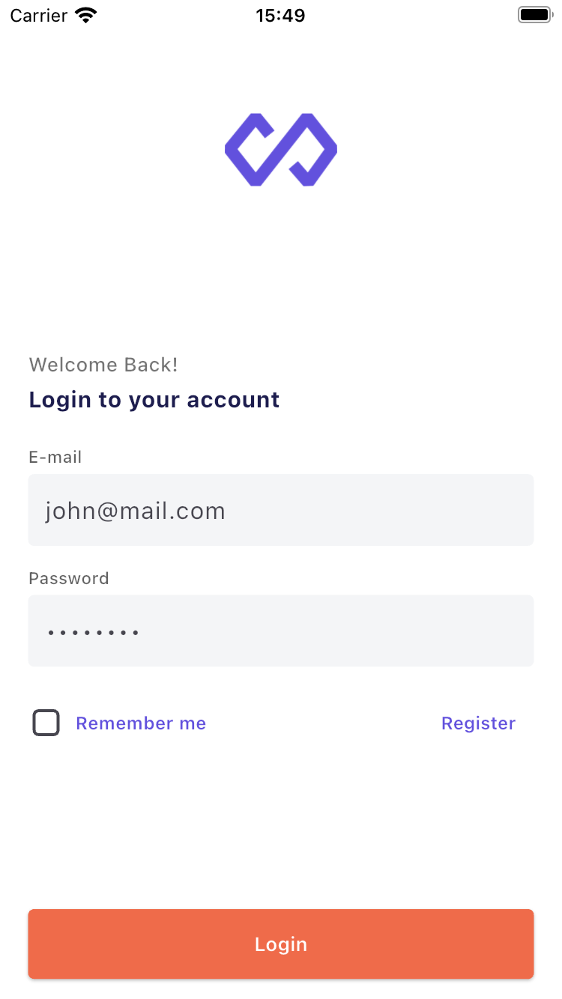
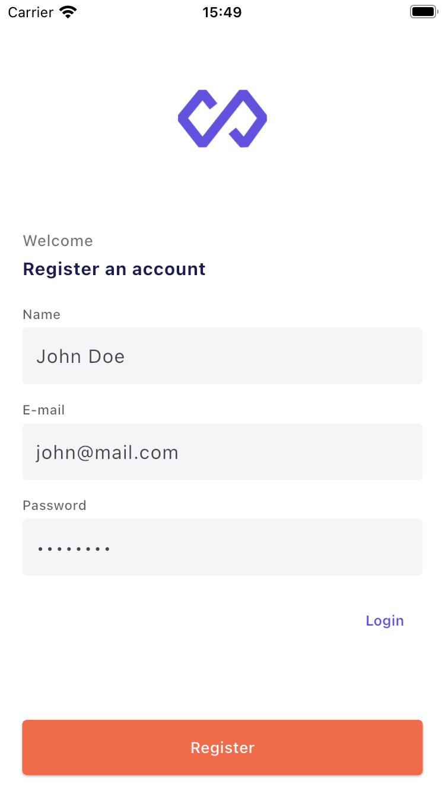
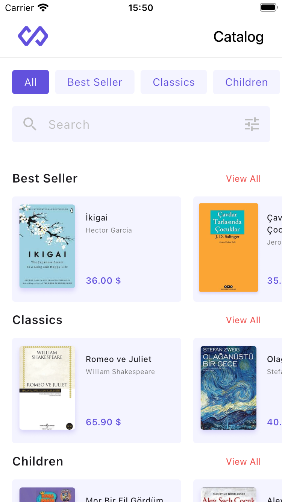
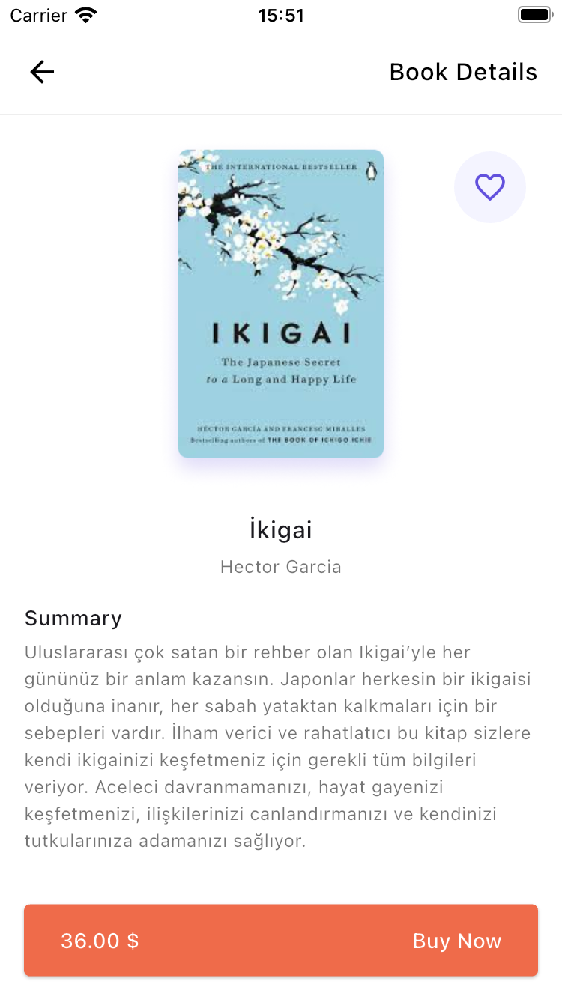
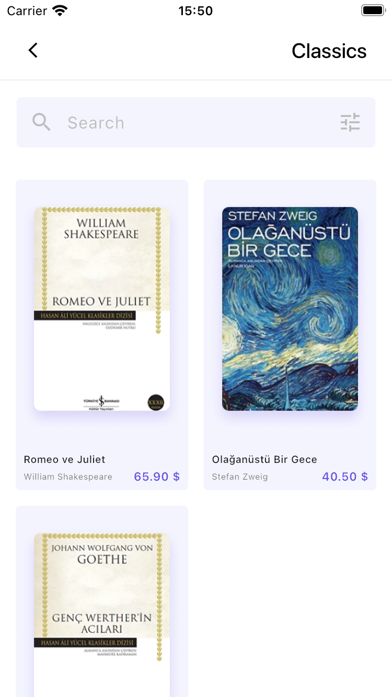

# Product Catalog App

A modern book catalog application developed with Flutter.

## Features

- 🔐 User Authentication
  - Login/Register system
  - Remember Me feature
  - Form validations
  
- 📚 Product Management
  - Book listing by categories
  - Detailed book pages
  - Favorite book marking
  - Search function
  
- 🌍 Multi-Language Support
  - Turkish
  - English
  
- 💫 User Experience
  - Responsive design
  - Easy navigation
  - Category filtering
  - Search feature

## Screenshots

| Login | Register | Home |
|:---:|:---:|:---:|
|  |  |  |

| Product Detail | Category Detail |
|:---:|:---:|
|  |  |

## Getting Started

### Prerequisites

- Flutter SDK
- Dart SDK
- Android Studio / Xcode (for running on emulators)

### Installation

1. Clone the repository
```bash
git clone https://github.com/yourusername/product-catalog.git
```

2. Install dependencies
```bash
flutter pub get
```

3. Run code generation
```bash
flutter pub run build_runner build --delete-conflicting-outputs
```

4. Run the app
```bash
flutter run
```

## Architecture

- State Management: Riverpod
- Dependency Injection: Injectable
- Network Layer: Dio
- Local Storage: Hive & SharedPreferences
- Code Generation: Freezed

## Project Structure

```
lib/
├── core/
│   ├── constants/
│   ├── theme/
│   ├── init/
│   └── utils/
├── features/
│   ├── auth/
│   ├── home/
│   ├── product/
│   └── splash/
└── product/
    ├── cache/
    ├── di/
    ├── models/
    └── widgets/
```