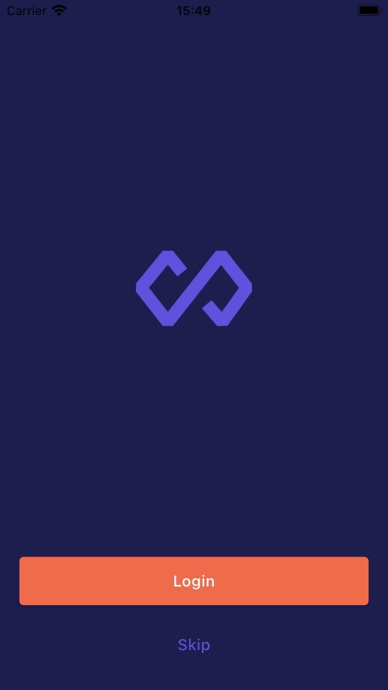

# Product Catalog App

A modern book catalog application developed with Flutter.

## Features

- 🔐 User Authentication
  - Login/Register system
  - Remember Me feature
  - Form validations
  
- 📚 Product Management
  - Book listing by categories
  - Detailed book pages
  - Favorite book marking
  - Search function
  
- 🌍 Multi-Language Support
  - Turkish
  - English
  
- 💫 User Experience
  - Responsive design
  - Easy navigation
  - Category filtering
  - Search feature

## Screenshots

| Splash | Login | Register |
|:---:|:---:|:---:|
|  |  |  |

| Home | Product Detail | Category Detail |
|:---:|:---:|:---:|
|  |  |  |

## Getting Started

### Prerequisites

- Flutter SDK
- Dart SDK
- Android Studio / Xcode (for running on emulators)

### Installation

1. Clone the repository
```bash
git clone https://github.com/yourusername/product-catalog.git
```

2. Install dependencies
```bash
flutter pub get
```

3. Run code generation
```bash
flutter pub run build_runner build --delete-conflicting-outputs
```

4. Run the app
```bash
flutter run
```

## Architecture and Technologies

### State Management
- **Riverpod**: Used for state management throughout the application
  - Provider definitions
  - AsyncValue usage
  - State notifier implementations

### Local Storage
- **SharedPreferences**: Simple data storage
  - User preferences
  - Token storage
  - "Remember Me" feature

### Multi-Language Support
- **Easy Localization**: TR/EN language support
  - JSON-based translation files
  - Context extension methods
  - Dynamic string formatting

### UI/UX
- **Material Design**: Modern and clean interface
- **Responsive Design**: Adaptation to different screen sizes
- **Custom Widgets**: Customized components

## Project Structure

```
lib/
├── core/
│   ├── constants/
│   ├── providers/
│   └── utils/
├── features/
│   ├── auth/
│   │   ├── models/
│   │   ├── providers/
│   │   ├── repositories/
│   │   └── views/
│   ├── category/
│   │   ├── providers/
│   │   └── views/
│   ├── home/
│   │   ├── providers/
│   │   └── views/
│   ├── product/
│   │   ├── models/
│   │   ├── providers/
│   │   ├── services/
│   │   └── views/
│   └── splash/
│       └── providers/
│       └── views/
└── main.dart
```

### Layers

- **Core**: Basic configurations and helper classes
- **Features**: Each feature has its own folder in a modular structure
  - Auth: Authentication
  - Category: Category management
  - Home: Home page
  - Product: Product management
  - Splash: Splash screen